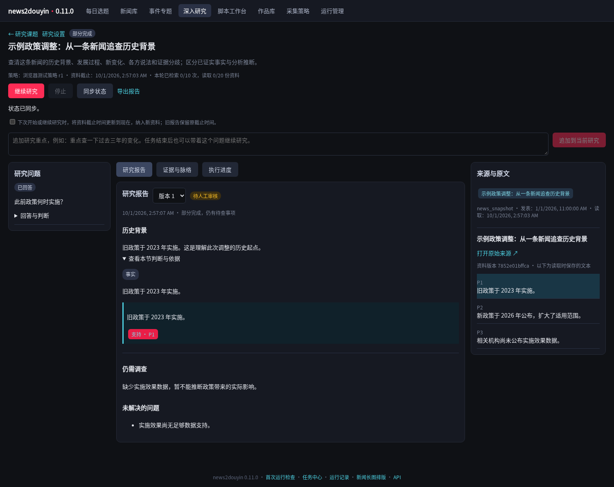
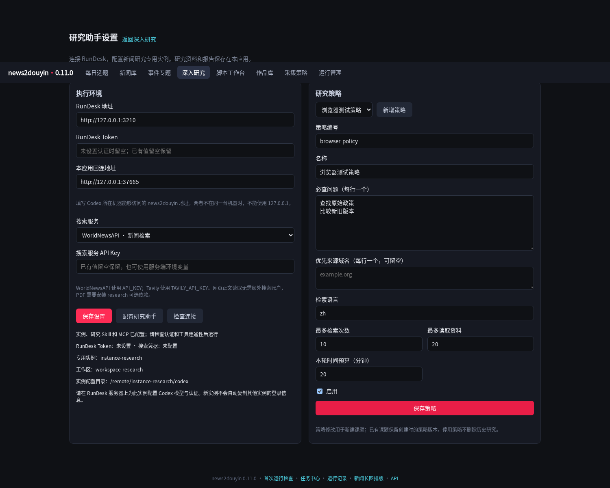

# 0.11.0 验证记录

## 验证范围

本版实现 RunDesk 新闻研究的配置、业务数据、MCP 和专用工作台。RunDesk 侧采用 v0.5.4 源码对应接口的测试夹具；没有使用用户的真实 Codex 认证或付费搜索凭据。

- 研究专项：17 项通过，覆盖实例级 Skill/MCP、重复配置、无关 MCP 保留、凭据隐藏、研究到证据/报告的写回、重复工具调用、报告版本、精确摘录与跨课题校验、停止后迟到写入、提交期间停止、提交超时不重发、完成但缺报告的状态、追加要求去重、策略快照、检索预算、未来来源排除、私网地址拒绝、继续时的截止时间与旧报告保护、中断提交恢复、文字型 PDF 提取。
- 全量 Python 测试：251 项通过，17 项跳过。跳过项目为当前环境缺少可选视频/语音组件的既有检查；视频不在本次开发范围。
- 官方 MCP Python SDK 1.30.0：6 项通过；实际 HTTP 连接验证协议协商（2025-11-25）、工具结构发现、课题上下文、来源段落读取、报告写回、ping。
- Chromium 154：13 项通过，覆盖实例/Skill/MCP 配置、连接检查、新建策略、新闻详情入口与后台启动、运行中追加要求、报告与缺口保存、报告定位原文段落、导出、时间节点候选、刷新保留、继续与停止、390px 移动布局无横向溢出、无 JavaScript 异常。
- 安装包验证见 `release/BUILD_INFO.txt`；构建后检查 Python、HTML、JavaScript 和研究 Skill 资源与源码一致。

## 复现

```bash
python -m pytest -q
python -m pytest -q tests/test_research.py
```

`tools/smoke_research_server.py` 为本地契约测试夹具，不能用于生产部署。
`tools/smoke_research_mcp.py` 使用官方 MCP 客户端；MCP SDK 仅为测试依赖，生产服务不要求安装。
`tools/smoke_research_browser.cjs` 和 `tools/smoke_research_all.py` 提供浏览器联调。测试使用同一进程网络环境启动临时服务，结束后清理临时运行数据。浏览器运行需要 Playwright、Chromium 和可显示中文的字体。

## 实机仍需验证

真实 RunDesk 中的专用实例模型认证、MCP 回连地址、搜索服务账户，以及多轮新闻研究质量。配置检查通过并不意味着这些效果已经验收。原文可能受登录、付费墙、动态渲染或扫描 PDF 影响；不能读取时应留下资料缺口。

## 界面记录

以下均为测试夹具生成的示例内容，不是真实模型研究结果。




